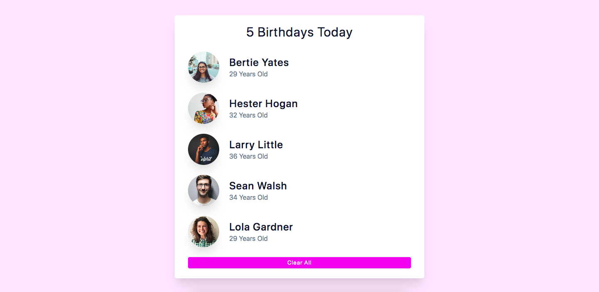

# Birthday Buddy



## Project Description

An application designed to provide birthday reminders to the one's closest to you.

In this project, `react.js` was used to created this landing page along with it's functionality. `CSS` was also used for the styling portion.

## Important Links

- https://birthdaybud.netlify.app

### Setup Steps

1. [Fork and Clone](https://github.com/iamatos3/birthday-buddy) this repository.
2. ```npm install```
3. ```npm run dev```

### Technologies Used

- Vite
- React.js
- HTML
- CSS
